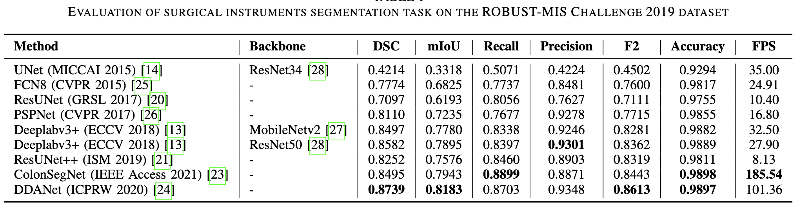
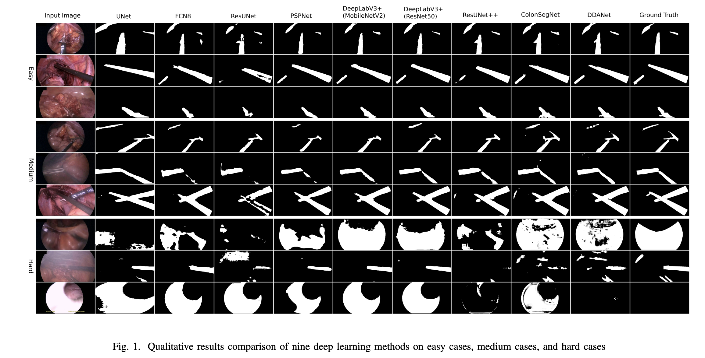

# U-Net Architecture for Surgical Image Segmentation (ROBUST-MIS-Challenge-dataset)

 **U-Net** is a renowned convolutional neural network (CNN) designed primarily for biomedical image segmentation. 

 

Kindly note that the figure is taken from the original paper. 

## 🔍 Key Features

- **Symmetrical Design**: Comprising an encoder (contracting path) and a decoder (expansive path).
- **Skip Connections**: Retain spatial context by bridging encoder and decoder.
- **Efficient and Precise**: Requires fewer training samples but offers high precision.

## Structure

1. **Encoder**:
   - Two 3x3 convolutions followed by a ReLU and a 2x2 max pooling.
   - Feature channels double after each pooling.
  
2. **Bottleneck**:
   - Two 3x3 convolutions with ReLU activation.

3. **Decoder**:
   - Upsampling and a 2x2 transposed convolution.
   - Concatenation with skip-connected feature map from the encoder.
   - Two 3x3 convolutions with ReLU.

4. **Output**:
   - 1x1 convolution to map to the number of classes.

## Applications

- **Original**: Biomedical image segmentation.
- **Extended**: Any Semantic segmentation tasks.

For a deeper dive, check out the [link_to_paper](https://arxiv.org/abs/1505.04597)).

We have implemented U-Net on the Binary instrument segmentation task from the ROBUST-MIS Challenge dataset. 

## Dataset
We have used a binary segmentation dataset from the ROBUST-MIS Challenge. You can down the dataset from <a href="https://robustmis2019.grand-challenge.org/">here</a>.

## Results

## Discussion
We got the best results with [DDANet](https://arxiv.org/pdf/2012.15245.pdf) on this dataset. 

The official link to the DDANet code can be found [here](https://github.com/nikhilroxtomar/DDANet). 

## More description and citation
More details about the work can be found in our paper. Please cite our work [Exploring Deep Learning Methods for Real-Time Surgical Instrument Segmentation in Laparoscopy](https://arxiv.org/pdf/2107.02319.pdf) if you find it useful. 

